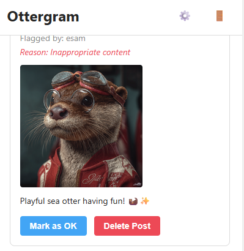
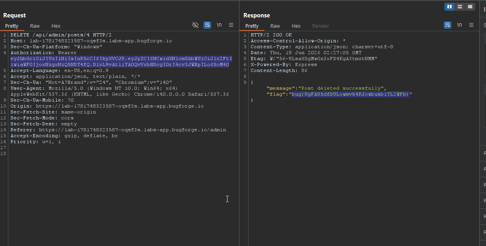
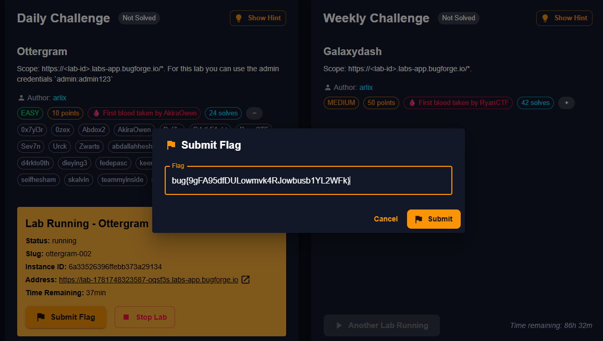

---
title: "Ottergram — Bugforge Daily Challenge #1"
published: 2026-06-18
description: My walkthrough of the Ottergram Web CTF challenge on Bugforge, showing how broken access control can expose an administrative post deletion endpoint.
image: ./after-flag-post.png
tags: [CTF, Web Security, Broken Access Control, Writeup]
category: CTF
bismillah: true
series: "Bugforge Daily Challenges"
seriesOrder: 1
draft: false
---

# Ottergram: Broken Access Control Walkthrough

In this post, I walk through the **Ottergram** challenge from Bugforge's Daily Challenges. This is an **Easy** difficulty web application challenge worth 10 points.

The vulnerability demonstrated in this challenge is **Broken Access Control**, specifically missing function-level access control on administrative API endpoints.

---

## Challenge Overview

- **Platform:** Bugforge Daily Challenge
- **Challenge Name:** Ottergram
- **Difficulty:** Easy
- **Category:** Web Security / Broken Access Control
- **Target URL:** `https://<lab-id>.labs-app.bugforge.io`
- **Initial Credentials Provided:** `admin:admin123`

---

## Step-by-Step Exploitation

### Step 1: Reconnaissance and Flagging a Post

Upon navigating to the target app, I see **Ottergram**, a simple photo-sharing social application.

The feed includes a post by user `otter_lover`.


At the bottom right of the post, there is a flag icon. Clicking it opens a moderation report prompt, where I flag the post for **"Inappropriate content"**.

---

### Step 2: The Admin Review Queue

Under the hood, flagged posts are sent to a moderation queue for administrative review at `/admin`.

Visiting the admin panel shows the post flagged by `esam`:



As an administrator, there are two buttons available:

- **Mark as OK**
- **Delete Post**

If a standard user visits the main feed, they do not have access to any delete buttons. The next step is to check whether the server restricts the underlying API endpoint from being called by a regular user.

---

### Step 3: Intercepting the Action

Using a proxy tool like **Burp Suite** or the browser's Developer Tools network tab, I capture the request sent when deleting a post.

The delete button calls this API endpoint:

```http
DELETE /api/admin/posts/4
```

I test whether my regular user token, belonging to `esam`, can call this endpoint directly. I send the request via Burp Suite Repeater using my normal user session JWT token:



:::important[The Vulnerability]
The server fails to perform authorization checks. Although the endpoint is `/api/admin/posts/4`, it only validates that the caller has a valid JWT token, without checking whether the user holds the **Admin** role.
:::

The server accepts the unauthorized request and successfully deletes the post.

---

### Step 4: Obtaining the Flag

The server response contains the post-deletion message along with the flag:

```json
{
  "message": "Post deleted successfully",
  "flag": "bug{9gFA95dfDULowmvk4RJowbusb1YL2WFk}"
}
```

I can now submit this flag on the Bugforge dashboard:



The flag is:
:spoiler[bug{9gFA95dfDULowmvk4RJowbusb1YL2WFk}]

---

## Remediation and Prevention

To fix this vulnerability, the application should enforce strict authorization checks on the server:

1. **Implement server-side role checks:** Do not rely on hiding buttons in the frontend UI. The server must verify that the requesting user's JWT contains the `admin` role before processing requests at `/api/admin/*`.
2. **Follow the principle of least privilege:** Users should only have access to API endpoints that are strictly necessary for their role.
3. **Use shared authorization middleware:** Wrap administrative routes with consistent authentication and authorization checks.

<spoiler>flag{access_control_matters}</spoiler>
