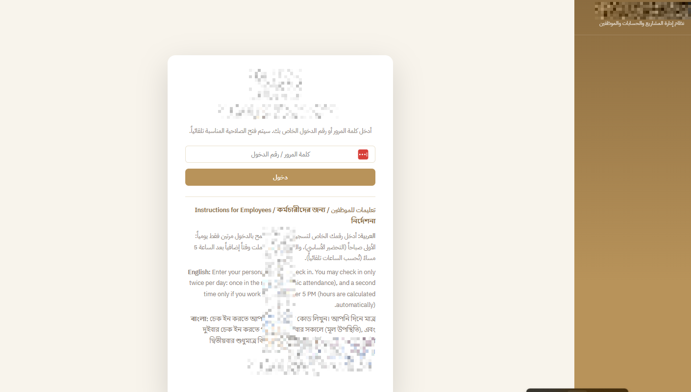
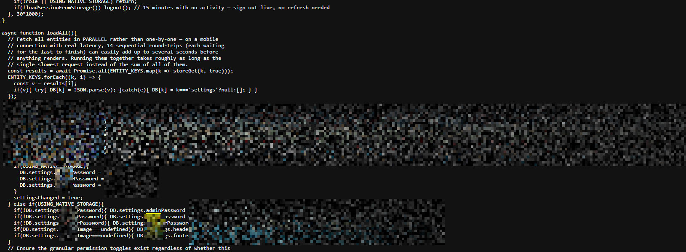
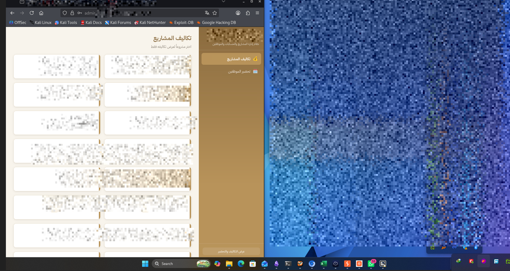
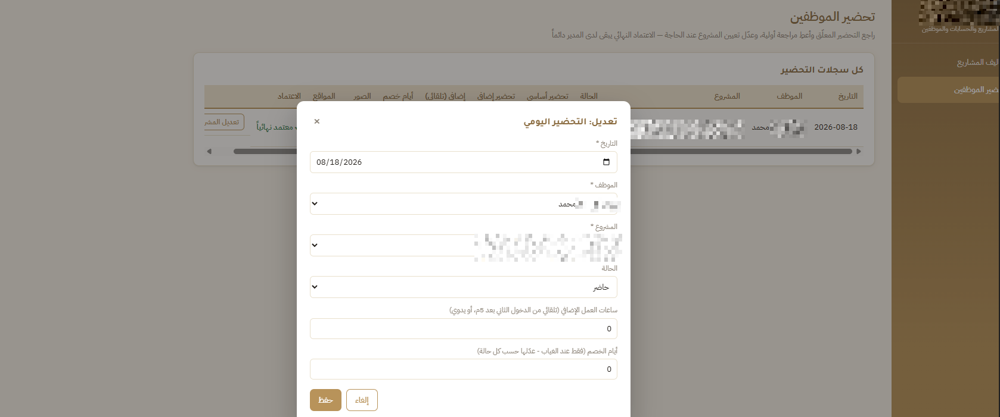

A company in Riyadh reached out with a simple request: before trusting their brand-new platform with real business data, they wanted someone to try breaking into it. The platform — a project, employee, and cost-management system — had been generated by their team using Claude through an AI app-builder.

The rules were pure black-box: one URL, no credentials, no documentation. My job was to answer one question — *can an outsider get in?*

Short answer: yes. In under two minutes. Here's how it went.

## First Contact

The engagement started the way every web pentest does — with a login page.



With all the hype around AI-written software lately, I half-expected a real fight. So before typing a single character into that password field, I did what I always do first on a black-box target: opened **view-source** to see what we're dealing with.

## Two Minutes to Admin

Sitting right there in the client-side JavaScript:

```js
DB.settings.adminPassword = "...";
DB.settings.managerPassword = "...";
```

Hardcoded default credentials for every role, shipped straight to the browser. No fuzzing. No injection. No clever authentication-bypass chain. Just View Source. Somewhere in Riyadh, Claude was very proud of itself.



I picked the admin password and signed in.

## Inside the Platform

From the admin panel, everything opened up: project archives, employee records, daily payroll entries — the exact data this platform was built to protect.





I now know what everyone at that company gets paid. I did not want to know what everyone at that company gets paid.

Evidence collected, screenshots sent to the client, engagement closed.

## The War Room

No report of mine is complete without revealing the state-of-the-art offensive operations center where all this happened:


Impressive, I know. Try not to be intimidated by the equipment. Total billable time for this engagement: less than it takes to explain the invoice.

## Why AI-Generated Code Ships Bugs Like This

This isn't a Claude problem — it's a how-you-use-it problem:

1. **AI writes code confidently**, including insecure patterns like secrets baked into client bundles.
2. **Nobody reviews the output** with a security mindset, so those patterns ship to production.
3. This lands squarely in **OWASP A07:2021 — Identification and Authentication Failures**, and hardcoded credentials are its oldest member (CWE-798).

An AI tool will happily build you a beautiful login form. It will never warn you that you left the keys inside it.

## The Fix

1. **Move authentication server-side.** Credentials, tokens, and role checks never belong in client-side code.
2. **Rotate every leaked password immediately** — assume they are public.
3. **Treat AI-generated code like code from a stranger on the internet:** review it before you trust it.

## The Verdict

Credit where it's due: Claude did a decent job building the app. But until real AGI shows up, it still needs a human in the loop. Especially the one holding the password list.

If your "AI-built" platform manages your projects, employees, and money — ask someone who reads source code for a living to check it first. It might take them two minutes.
