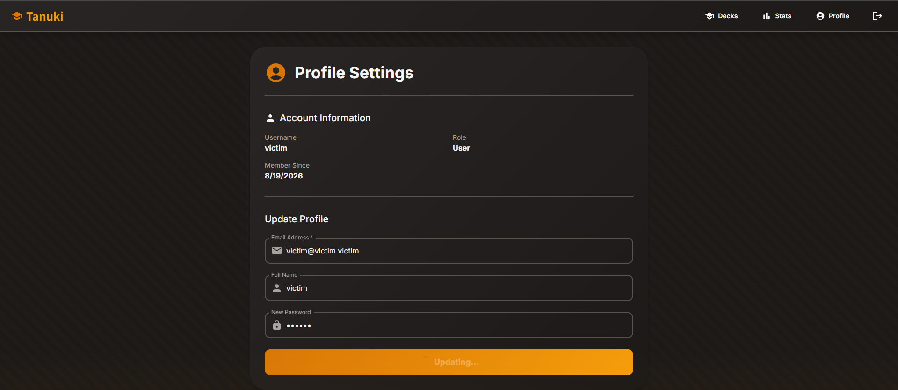
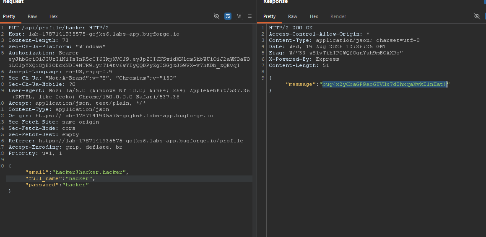

Bugforge drops a new web challenge every day — this one is called **Tanuki**. The goal is simple: get the flag from the admin account. The path there turned out to be a textbook broken access control problem.

## Recon

The app lets you register and log in as a regular user. I created two accounts to play with:

- `hacker` / `hacker@hacker.hacker` — the attacker
- `victim` / `victim@victim.victim` — the target



Then I logged in as the victim and started poking at the profile page.

## The Flaw

The profile update request caught my eye:

```http
PUT /api/profile/hacker HTTP/2
Authorization: Bearer <victim JWT>
Content-Type: application/json

{"email":"hacker@hacker.hacker","full_name":"hacker","password":"hacker"}
```

Look closely at what's wrong here:

1. The **username comes from the URL path**, not from the JWT.
2. The server only checks that the Bearer token is **valid** — not that it belongs to `hacker`.
3. So I'm authenticated as `victim`, but updating the profile of `hacker`.

That's a broken function-level authorization check (BOLA/IDOR family, OWASP A01:2021).

## The Takeover

I sent exactly that request — victim's token, hacker's profile, and a password I control:



Boom. The update went through, which effectively merged the accounts: the `victim` session could now authenticate as `hacker`, and logging in as the attacker gave me access to whatever that account holds — flag included.

I didn't fully expect it to work on the first try. It did anyway.

## Remediation

- **Derive identity server-side:** never take the username from the URL when a valid session exists — read it from the verified token.
- **Object-level authorization:** confirm the authenticated user owns (or may modify) the target resource on every request.
- **Deny by default** for cross-account mutations, and log them loudly.

<spoiler>flag{tanuki_profile_pwnage}</spoiler>
