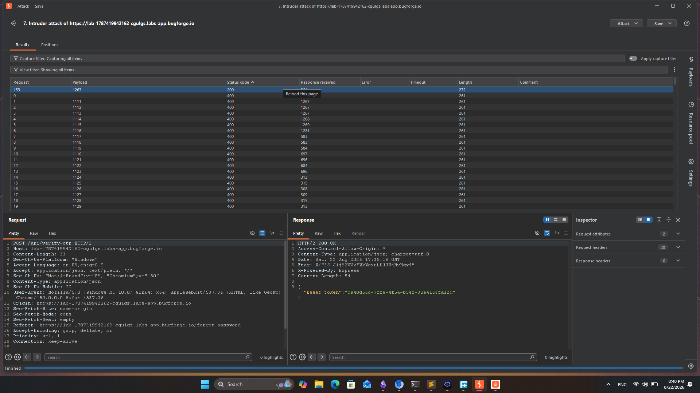
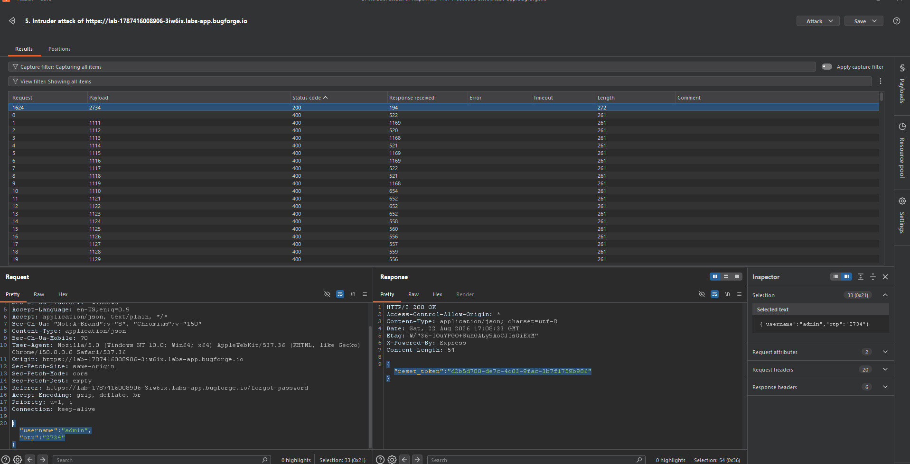
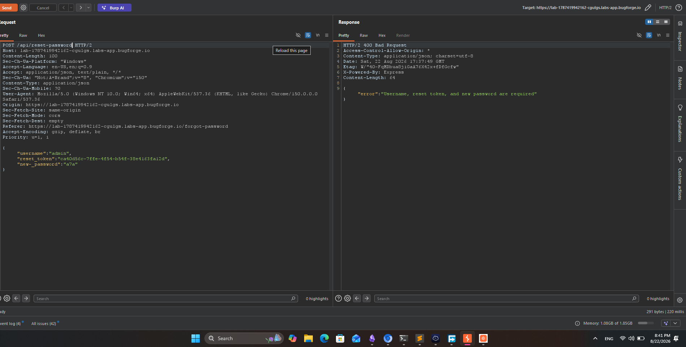
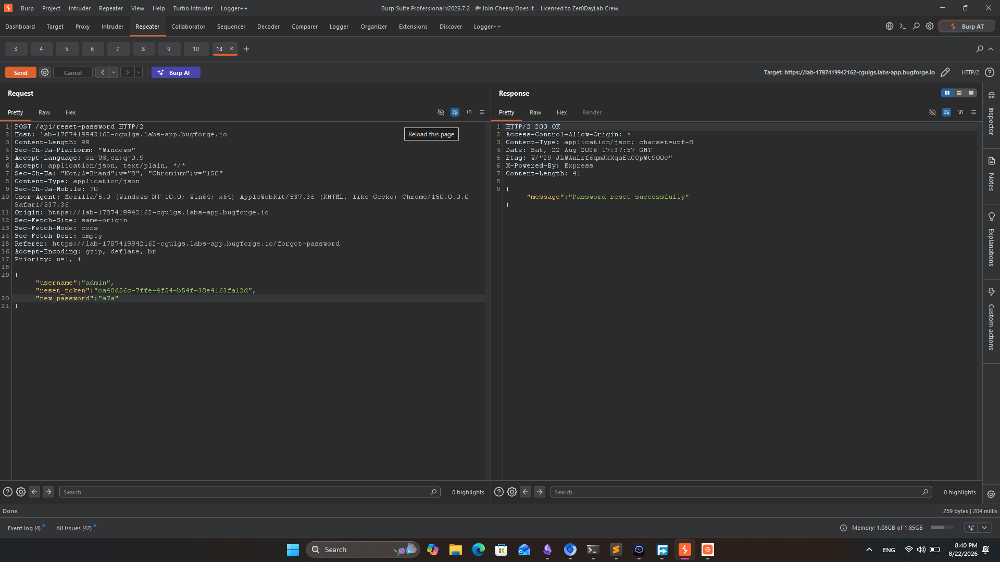
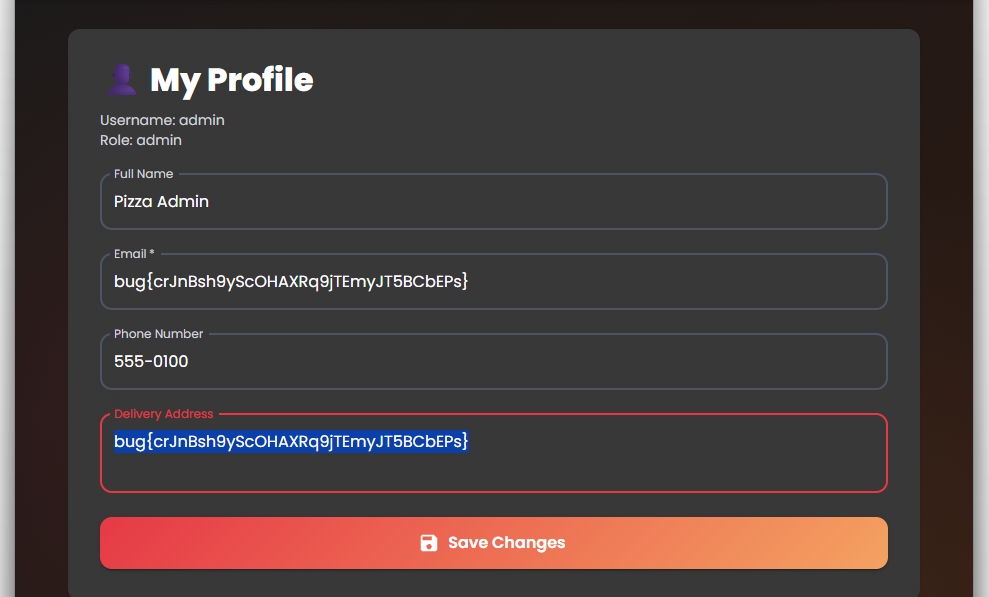

**Cheesy Does It** — the name alone promised something silly, and the bug delivered. This one was a password-reset flow that trusted a 4-digit OTP way too much.

## The Setup

The app had a login page, and right on it a hint pointing at the change-password flow. That's an invitation — so I went straight to the forgot-password endpoint and started mapping it:

1. `POST /api/verify-otp` — verifies the OTP and returns a reset token
2. `POST /api/reset-password` — consumes username + reset token + new password

## Step 1: Brute-Forcing the OTP

The OTP was numeric. Numeric codes have a bad habit of being short — this one was **4 digits**, which means exactly 10,000 possibilities. No rate limiting, no lockout, no captcha. That's not security; that's a countdown.

I fed the request to Burp Intruder and let it iterate the OTP space:



A few seconds later, one request stood out from the sea of 400s:

```json
{ "username": "admin", "otp": "1263" }
```

Response: `200 OK` — and look what came back with it:

```json
{
  "reset_token": "ca40d56c-7ffe-4f54-b54f-38e4163fa12d"
}
```

The server didn't just verify the OTP — it **handed me the reset token directly in the response**. No email required, no out-of-band step, nothing. I re-ran the attack against a fresh lab instance to confirm (that one cracked on `2734`):



## Step 2: Resetting the Password

With username + reset token in hand, I called the reset endpoint. First attempt failed because I forgot the `new_password` field — the error message helpfully told me what was missing:



Fixed the payload:

```json
{
  "username": "admin",
  "reset_token": "ca40d56c-7ffe-4f54-b54f-38e4163fa12d",
  "new_password": "a7a"
}
```

And boom — password changed:



## Step 3: Admin

Logged in as `admin` with my new password. Full profile access, flag included:



## What Was Broken

Three failures stacked into one takeover:

1. **No rate limiting or lockout** on OTP verification — 10,000 tries is nothing to a script.
2. **Short, fully numeric OTP** — a 6+ character alphanumeric code would have made brute force impractical.
3. **Reset token returned in the API response** — the one thing that was supposed to arrive out-of-band was delivered by the attacker's own request.

Any single fix here breaks the chain.

## Remediation

- Rate-limit OTP attempts per account **and** per IP, with exponential backoff and lockout.
- Use long, random codes (6+ characters minimum) and expire them fast.
- Never return reset tokens in responses — deliver them through a verified channel only.
- Add generic error messages and monitoring for burst traffic on auth endpoints.

<spoiler>flag{cheesy_otp_takeover}</spoiler>
