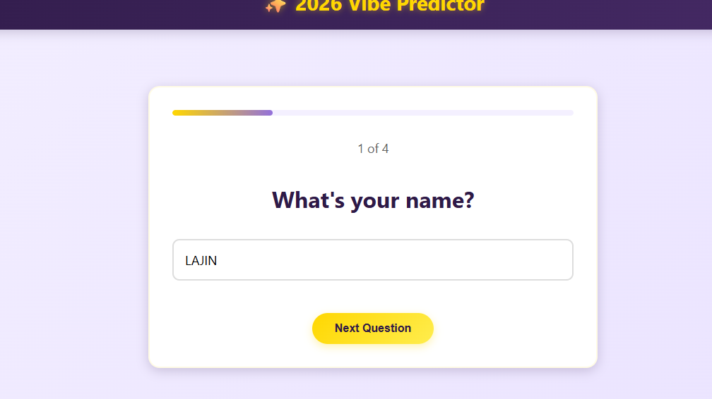
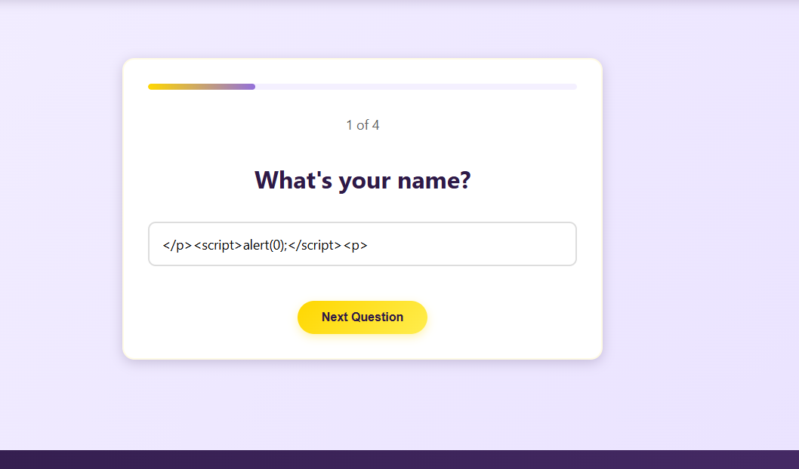
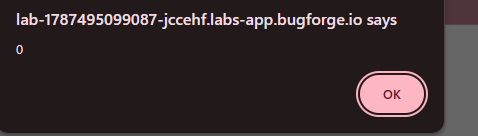
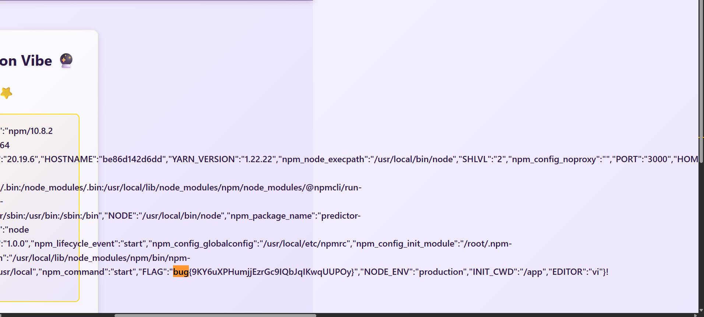

# 2026 Vibe Predictor: Server-Side Template Injection Walkthrough

In this post, I walk through the **2026 Vibe Predictor** challenge from Bugforge's Daily Challenges. On the surface it is a harmless fortune-telling quiz — answer four questions, receive an absurd prediction for the new year. Under the hood, it hides a much more serious bug.

The vulnerability demonstrated in this challenge is **Server-Side Template Injection (SSTI)** in an **EJS** template, which escalates from reflected input all the way to remote code execution.

---

## Challenge Overview

- **Platform:** Bugforge Daily Challenge
- **Challenge Name:** 2026 Vibe Predictor
- **Category:** Web Security / SSTI (EJS)
- **Target URL:** `https://<lab-id>.labs-app.bugforge.io`

---

## Step-by-Step Exploitation

### Step 1: Reconnaissance

The app greets you with a purple New Year theme: *"Welcome to 2026 — The Year of Mysterious Predictions"*, promising a personalized and "harmlessly absurd" fate.


Clicking **Get My Prediction** starts a 4-question quiz. The very first question is simply **"What's your name?"** — and any field that asks for a name and echoes it back later is worth watching closely.



---

### Step 2: Finding the Reflection

After finishing the quiz, I checked the page source. My name came back embedded in the server-rendered HTML:

```html
<p class="greeting-text">Hello, LAJIN! ✨</p>
```

The greeting is rendered on the server — it is not patched into the DOM by client-side JavaScript. That distinction matters: my input passes through the backend's template engine.

:::important[The Observation]
User input is reflected inside server-rendered HTML. Before dreaming about XSS, the real question is: does that input pass through a template engine that *evaluates* syntax, or one that only *escapes* it?
:::

---

### Step 3: From XSS to SSTI

First, the classic test — break out of the `<p>` tag and inject a script:

```html
</p><script>alert(0);</script><p>
```



It fired — the browser popped an alert straight from the lab domain:



Fun, but on a challenge like this, XSS is rarely the finish line. Since the reflection happens **server-side**, I suspected a template engine was involved. I tried SSTI and SQLi payloads across several template syntaxes, and the one that answered back was EJS:

```
<%= 7*7 %>
```

The expression was evaluated — the server returned `49` instead of echoing the literal string. `<%= %>` is EJS's output tag, which tells me two things: the backend is **Node.js running EJS**, and my input is interpolated directly into the template.

---

### Step 4: From Math to RCE — Dumping the Environment

`<%= %>` evaluates arbitrary JavaScript expressions inside the template. That is not just template injection — it is **server-side code execution**. The classic move: dump `process.env`, where CTF flags love to live:

```
<%= JSON.stringify(process.env) %>
```

The rendered page printed the entire environment as JSON — npm paths, hostname, port — and right in the middle of it:

```json
"FLAG": "bug{9KY6uXPHumjjEzrGc9IQbJqIKwqUUP0y}"
```



The flag is:
:spoiler[bug{9KY6uXPHumjjEzrGc9IQbJqIKwqUUP0y}]

---

## Remediation and Prevention

To fix this vulnerability, the application should ensure user input never reaches the template engine as *code*:

1. **Pass data, not templates:** render user input as a variable (`res.render("page", { name })`), never by concatenating it into the template string itself.
2. **Treat every reflection point as an injection point:** if input can land inside a template engine's delimiters, an attacker can execute code on the server.
3. **Validate and encode input:** reject or escape template syntax like `<%= %>` and `${}` in fields that should only ever hold plain text.
4. **Contain the blast radius:** run the app with least privilege and keep secrets (like flags) out of environments that user-facing code can read.

<spoiler>flag{ejs_ssti_vibe_check}</spoiler>
